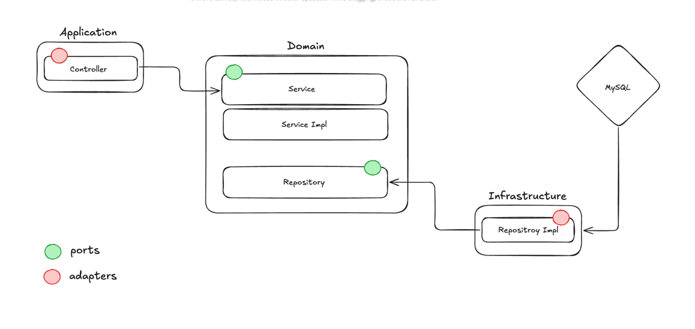

# 🧙‍♂️ Hogwarts Library Service

A backend system for managing a magical bookstore — built with **Spring Boot**, **MySQL**, **Flyway**, and **JOOQ**. The
service supports inventory management, dynamic pricing logic, and a loyalty system.

---

## 🛠 Tech Stack

- Java 17
- Spring Boot
- JOOQ
- Flyway
- MySQL
- Docker

---

## 🧑‍💻 Running the Service

### ✅ Prerequisites

- Java 17+
- Maven
- Docker (optional for containerized approach)

---

### ▶️ Running Locally (without Docker)

1. **Set up MySQL locally**

   Create a database called `hogwarts_library` and update your `application.yml`

   ```properties
   spring.datasource.username=root
   spring.datasource.password=your_password

2. **Build and run**

   Migrations and seeding will be triggered automatically in build time.

   ```properties
   mvn clean install
   java -jar target/hogwarts-library-0.0.1-SNAPSHOT.jar


### 🐳 Postman Collection
You can find it inside `postman` directory in project root.
### 🐳 Running with Docker

1. **Run using Docker Compose**

   ```bash
   docker-compose up -d
   ```

   This will spin up:
    - MySQL DB (with `hogwarts_library` schema)
    - Spring Boot app on `latest` version
    - Flyway migration

### 🧭 System Overview

This project follows the Hexagonal Architecture (a.k.a. Ports and Adapters) pattern to promote separation of concerns, testability, and scalability.

### 🔍 Future improvements
-	Book Type Persistence:
Book types are currently represented as enums. While sufficient for simplicity, a dedicated database table would be more flexible and allow for dynamic extension in the future.
-	Book Quantity Tracking:
The system does not track the inventory count of each book. There’s no record of how many copies of a specific book exist or are available within the library.
-	Code Quality:
Minor issues such as typos or unused imports may exist :) .